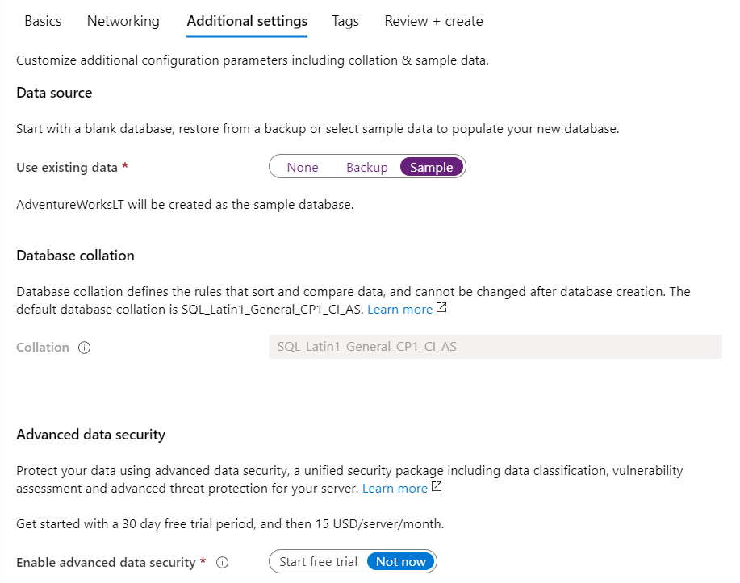
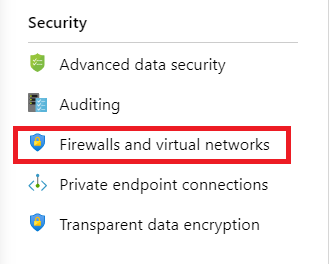

---
lab:
    title: 'Lab 2 – Deploying Azure SQL Database'
    module: 'Plan and Implement Data Platform Resources'
---

# Lab 2 – Deploying Azure SQL Database

**Estimated Completion Time:** 35-40 minutes

**Pre-requisites:** None

**Lab files:** None

# Lab Overview

The student will configure basic resources needed to deploy an Azure SQL Database with a Virtual Network Endpoint.

# Lab Objectives

The students will:

1. Configure basic resources

2. Deploy an Azure SQL Database 

# Scenario

As a database administrator for AdventureWorks, you will set up a new SQL Database, including a Virtual Network Endpoint to increase and simplify the security of the deployment.

# Exercise 1: Configure Basic Resources

## Task 1: Create a Resource Group

1. Start a browser, and open the Azure Portal at [http://portal.azure.com](http://portal.azure.com/), logging in with the appropriate credentials

2. From the Home screen, click on the **Resource Groups** button  
‎
	

3. Review your existing Resource Groups and then click on the **Add** button to create a new Resource Group.  
‎
	

4. Complete the Create a Resource Group wizard with the required information to create the RG.

	- Ensure Subscription is set to the desired subscription

	- Enter **DP-300-Lab02** for the name of the Resource Group

	- For the purposes of this lab, select the Region nearest to your physical location

	- Click the **Review + create** button  
‎
	

	- Click the **Create** button

## Task 2: Create a Virtual Network

1. In the left navigation pane, click **Virtual Networks**  
‎
	Lab

2. Click **+ Add** to open the **Create Virtual Network** page. On the **Basics** tab, complete the following information:

	- Subscription: **Select the lab subscription**

	- Resource Group: Select the **DP-300-Lab02** Resource Group

	- Name: **Lab02-vnet**

	- Region: Select the same region when the Resource Group was created (the region nearest to your location)  
‎
	

	- Click the **Next: IP Addresses** button  
‎
	

3. Configure the virtual network’s IP range for the Azure SQL database endpoint

	- On the IP Addresses page, leave the defaults for the IPv4 address space.

	- Click on the **default** subnet  
‎
	

	- In the Edit subnet flyout on the right, expand the Services drop-down, and tick **Microsoft.Sql**  
‎
	

	- Click **Save**

	- Click the **Review + Create** button, review the settings for the new virtual network, and then click **Create**

# Exercise 2: Deploy an Azure SQL Database

## Task 1: Deploy an Azure SQL Database

1. From the Azure Portal, click on **+ Create a Resource** at the top of the left side navigation bar  
‎
	

2. Search for “SQL databases” in the search box at the top, then click **SQL Database** from the list of options  
‎
	

3. Click the **Create** button

4. Complete the Create SQL Database Basics screen with the following inputs and then click **Next: Networking**

	- Subscription: Select the lab subscription

	- Resource Group: **DP-300-Lab02** (the RG created in Exercise 1)

	- Database Name: **AdventureWorksLT**
	
	- Server: click **Create new.** In the New Server sidebar, complete the form as follows:

		- Server name: **dp300-lab-&lt;your initials (lower case)&gt;** (server name must be globally unique)

		- Server admin login: **dp300admin**

		- Password: **dp300P@ssword!**

		- Confirm password: **dp300P@ssword!**

		- Location: Select the Region nearest to you (same as in Exercise 1)

		- Your New server sidebar should look as shown below. Click **OK**

		

    -  Want to use Elastic Pool: **No**

    -  Compute + Storage: Click **Configure database**

		- On the Configure screen, click **Looking for basic, standard, premium?**

		

		- Click **Basic**

		- Click the **Apply** button

**Note: Make note of this server name, and your login information. You will use it in subsequent labs.**

5. Review settings and then click **Next: Networking**  
‎
	

6. On the Networking screen, for Connectivity method, click the **Private endpoint** radio button  
‎
	

7. Then click the **Add private endpoint** link under Private Endpoints  
‎
	

8. Complete the Create private endpoint flyout as follows:

	- Subscription: Ensure the lab subscription is selected

	- Resource group: **DP-300-Lab02**

	- Location: The same Region that was selected for previous parts of this lab

	- Name: **DP-300-SQL-Endpoint**

	- Target sub-resource: **SqlServer**

	- Virtual network: **Lab02-vnet**

	- Subnet: **default (10.x.0.0/24)**

	- The Private DNS integration options can remain at the default

	- Review settings before clicking **OK**  
‎
	

9. Confirm the endpoint appears on the Networking page, and then click the **Next: Additional settings** button.  
‎
	

10. On the Additional Settings page, select the following options:

	- Set Use existing data to **Sample**

	- Ensure enable advanced data security is set to **Not now**  
‎
	

11. Click **Review + Create**

12. Review the settings before clicking **Create**

13. Once the deployment is complete, click the **Go to resource** button  
‎

## Task 2: Enable All Azure Services access to new SQL Server

1. From the SQL Database blade, click on the link for the SQL Server name in the top section  
‎

	

2. On the SQL Server object’s navigation blade, click **Firewalls and virtual networks** under Security

	‎

3. Set Allow Azure services and resources to access this server to **Yes**  
‎

	

4. Click **Save**

 

 

 
